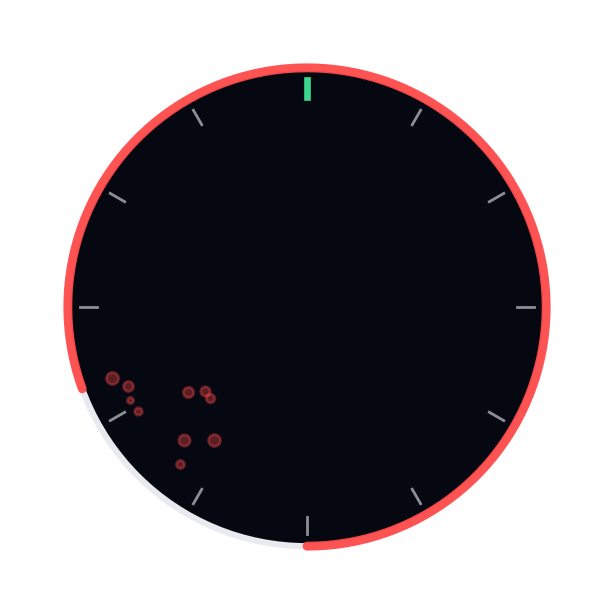
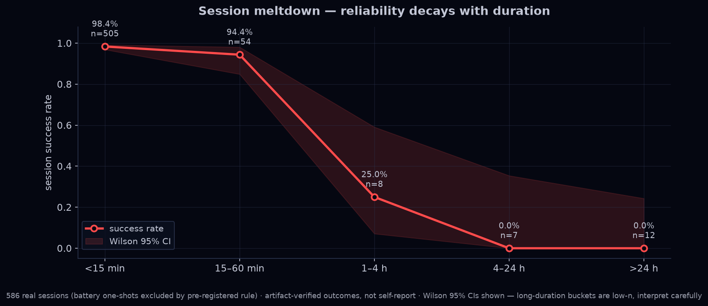
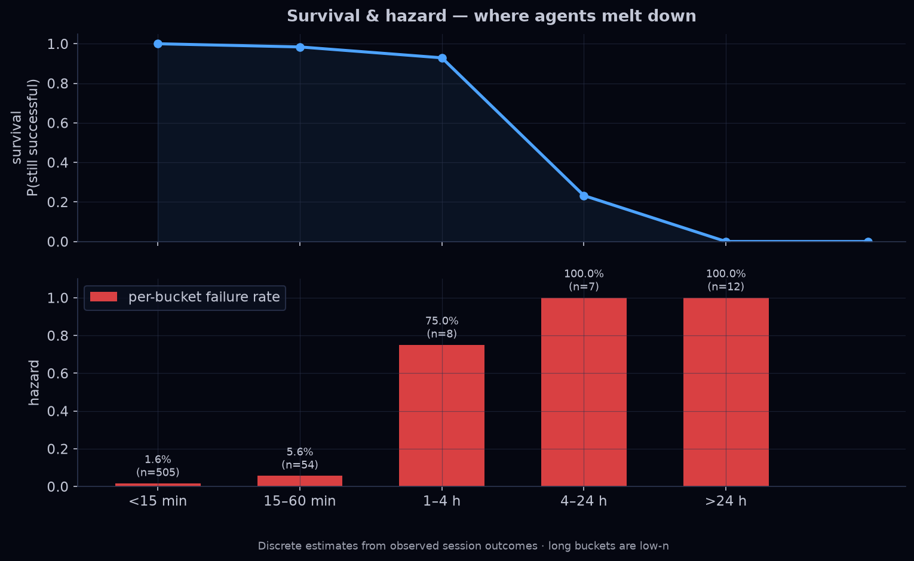
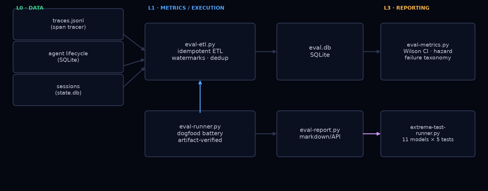

<p align="center">
  
</p>

<h1 align="center">CooLEVAL</h1>

<p align="center"><strong>Agent success collapses past the one-hour mark. We measured it on our own production traffic: 2 of 27 long sessions succeeded.</strong></p>

<p align="center">
  <code>586 sessions</code> · <code>777 tasks</code> · <code>&lt;15min: 98.4% (n=505)</code> · <code>&ge;1h pooled: 7.4% — 2/27 [Wilson 95% CI 2.1–23.4%]</code> · <code>Fisher exact p = 9.2e-34</code>
</p>

<p align="center">
  <a href="#the-meltdown-curve">See the curve</a> · <a href="#quickstart">Quickstart</a> · <a href="#limitations">Limitations</a>
</p>

> Dogfood evaluation framework for production AI agents. Every number in this README comes from `eval-metrics.py` over real sessions, run 2026-08-16 — not a synthetic benchmark.

## The Meltdown Curve

Short sessions look great. Long sessions don't fail linearly — they collapse.

CooLEVAL instruments **your agent on your workload** and measures success by session
duration, with Wilson 95% CIs and artifact-verified outcomes (never self-report).



| Session duration | Success | 95% CI (Wilson) | n |
|---|---:|:---:|---:|
| < 15 min | 98.4% | [96.9–99.2] | 505 |
| 15–60 min | 94.4% | [84.9–98.1] | 54 |
| 1–4 h | 25.0% | [7.1–59.1] | 8 |
| 4–24 h | 0.0% | [0.0–35.4] | 7 |
| > 24 h | 0.0% | [0.0–24.3] | 12 |
| **≥ 1 h (pooled)** | **7.4%** | **[2.1–23.4]** | **27** |

The individual long buckets are low-n (flagged exploratory by the n-gate); the
pooled contrast is not: **497/505 vs 2/27, Fisher exact p = 9.2e-34.** The collapse
is real. If your agent runs for more than an hour, it probably fails.

## Survival & Hazard Analysis



Survival (blue) tracks the probability a session is still successful as duration
grows; hazard (red) is the per-bucket failure rate. Guardrail metrics — tool
retries, loop events, context growth — are tracked as meltdown *precursors*, so you
can intervene before failure, not after.

## Quickstart

What you need: Python 3.10+, SQLite3, and agent telemetry in the expected schema
(JSONL spans + lifecycle events; see the header of `scripts/eval-etl.py`). Paths are
overridable via `EVAL_DB` / `EVAL_OUT` / `EVAL_ROOT` env vars.

```bash
git clone https://github.com/CooLCHI-gun/CooLEVAL.git && cd CooLEVAL
pip install pyyaml          # only dep outside stdlib

# 1. Ingest telemetry (idempotent — safe to rerun)
python3 scripts/eval-etl.py

# 2. Metrics: success rate, hazard curve, failure taxonomy (Wilson CIs, n-gate)
python3 scripts/eval-metrics.py

# 3. Dogfood battery: N runs of real tasks through your agent loop, artifacts verified
python3 scripts/eval-runner.py --task t1_file_summary --runs 10

# 4. Compare models on the same real tasks (any provider your agent supports)
python3 scripts/eval-runner.py --model claude-sonnet-4-6 --provider opencode-zen --runs 3

# 5. Extreme ceiling battery: frontier models × 5 hard tests via direct API
python3 scripts/extreme-test-runner.py --models claude-opus-5,deepseek-v4-pro

# 6. Report
python3 scripts/eval-report.py
```

Task specs are pre-registered with `spec_hash` and `difficulty` — reproducibility
without outcome-inferred labels.

## Extreme Tests — frontier models under stress

Five hard tests, each designed to find a model's ceiling (rubrics in the
`model-evaluation-protocol` methodology):

| Test | What it stresses | Failure signature |
|:--|:--|:--|
| T1 · Multi-step reasoning | USAMO-style telescoping proof + exact computation | Skipped steps, wrong derivation |
| T2 · Long-context recall | ~50K-token doc, 6 embedded facts, positional recall | Forgotten facts, position bias |
| T3 · Adversarial instruction | 10 rules incl. lipogram (no letter *e*) | Constraint forgetting |
| T4 · Concurrent code | 7+ requirements, retry scheduler, syntax-verified | Missing features, non-runnable |
| T5 · Agentic planning | Full-stack mission, fail conditions, confidence calibration | Vague phases, overconfidence |


*(Heatmap populates when the current 11-model battery completes — `scripts/summarize_extreme.py`.)*

Pre-flight findings (2026-08): providers list models that aren't callable — all
Claude-family endpoints rejected the `temperature` parameter (deprecated), GPT-family
required the Responses API, and a Gemini endpoint was down entirely.
`scripts/price-probe.py` catches this before you waste a battery.

## Architecture (L0–L3)

One script per layer, no framework.



```
L0  DATA      eval-etl.py      ← idempotent ETL: JSONL traces + SQLite lifecycle +
                                 sessions → eval.db (watermarks, dedup, reconciliation)
L1  METRICS   eval-metrics.py  ← success rate (Wilson CI), hazard curve, failure
                                 taxonomy, tool-failure rates, loopiness guardrails
L2  EXECUTION eval-runner.py   ← dogfood task battery, artifact-verified outcomes
              extreme-test-runner.py ← 5-test ceiling battery (direct API)
L3  REPORT    eval-report.py   ← markdown report; eval-api.py (read-only REST)
```

## Design Principles

- **Canonical task spec** — `task_key` + `spec_hash` + pre-registered difficulty; no outcome-inferred labels.
- **Failure taxonomy** — completed / failed / partial / user_abort / infra_fail with failure class; execution ≠ prompt ≠ tooling failure.
- **Hazard/survival analysis** — P(success \| duration ≥ t), pre-registered buckets + CIs; no post-hoc cutoff cherry-picking.
- **Minimum n gate** — n < 20 flagged exploratory; Wilson 95% intervals everywhere.
- **Artifact-verified outcomes** — pass = artifact exists and non-empty, checked independently of the agent's self-report.
- **Idempotent, reconcilable ETL** — rerunnable, dedup-able, auditable; automation only after the pipeline is proven.

## Repository Layout

```
scripts/
  eval-etl.py              L0 ETL (idempotent, reconcilable)
  eval-metrics.py          L1 metrics (Wilson CI, hazard curve, n-gate)
  eval-runner.py           L2 dogfood battery (artifact-verified)
  eval-report.py           L3 report generation
  eval-api.py              read-only REST API over the eval DB
  price-probe.py           provider pre-flight: which listed models actually respond
  extreme-test-runner.py   5-test ceiling battery (direct API, multi-provider)
  summarize_extreme.py     battery results → summary table + heatmap
  make_assets.py           regenerate the dark-theme visuals
assets/                    original visuals (regenerable via make_assets.py)
reports/                   generated reports
```

## Limitations

- Single-organization traffic: these numbers come from one deployment's workload, not a controlled benchmark.
- Task boundaries are self-reported by the session lifecycle; no covariate control for task difficulty vs duration.
- Long-duration buckets are small (n=8/7/12); the pooled ≥1h contrast is the defensible claim.
- Battery one-shot sessions are excluded from session-level analysis by a pre-registered rule.

## Roadmap

- [x] ETL + metrics + dogfood battery (artifact-verified)
- [x] Extreme ceiling battery (5 tests, direct API, multi-provider)
- [ ] Semantic validation of artifacts (beyond exists-and-non-empty)
- [ ] Token-efficiency metric (tokens-per-success, cache-adjusted)
- [ ] Weekly scheduled reports

## License

MIT — see [LICENSE](LICENSE).
