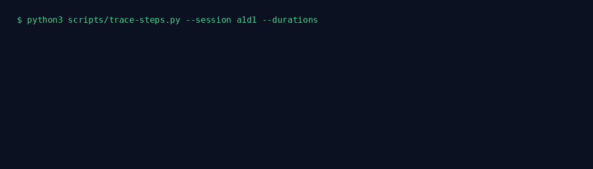

<p align="center">
  
</p>

<h1 align="center">CooLEVAL</h1>

<p align="center"><strong>How long can your AI agent work before it breaks?</strong><br>
Dogfood reliability metrics for production agents — measured on your own telemetry, not a benchmark.</p>

<p align="center">
  <a href="docs/README-zh-TW.md"><strong>繁體中文導讀 →</strong></a>
</p>

<p align="center">
  <code>586 sessions</code> · <code>&lt;15min 98.4%</code> · <code>&ge;1h 7.4% (2/27)</code>
</p>

<p align="center">
  
  
  
  
  
</p>

<p align="center">
  <a href="#why-cooleval">Why CooLEVAL</a> · <a href="#quickstart">Quickstart</a> · <a href="#step-level-trajectory">Step trace</a> · <a href="#the-meltdown-curve">The meltdown curve</a> · <a href="#limitations">Limitations</a>
</p>

> **98.4% success under 15 min → 7.4% over 1 hour — a 13.3× collapse in success rate**
> (failure risk ratio ≈ **58×**, 95% CI 29–117×). Every number here is printed by
> `eval-metrics.py` from our own real sessions (2026-08-16), not a synthetic benchmark.

## Why CooLEVAL

Your agent looks great in a 15-minute smoke test. **It doesn't fail linearly as it runs
longer — it collapses.** CooLEVAL instruments **your agent on your workload** and measures
success by session duration, with Wilson 95% CIs and artifact-verified outcomes (never
self-report). It's built for three things:

- **Session reliability** — meltdown / survival-hazard curves, Wilson CIs, n-gate.
- **Step-level trace** — see *which tool call* broke the run, whether it looped, and what shape the call took.
- **Honest & safe metrics** — no self-reported pass, PII-safe (records no raw arg/result values), self-hosted and zero-network.

## Quickstart

What you need: Python 3.10+, SQLite3, and agent telemetry in the expected schema
(JSONL spans + lifecycle events; see the header of `scripts/eval-etl.py`). Paths are
overridable via `EVAL_DB` / `EVAL_OUT` / `EVAL_ROOT` env vars.

```bash
git clone https://github.com/CooLCHI-gun/CooLEVAL.git && cd CooLEVAL
pip install pyyaml          # only dep outside stdlib

# 1. Ingest telemetry (idempotent — safe to rerun)
python3 scripts/eval-etl.py

# 2. Metrics: success rate, hazard curve, failure taxonomy (Wilson CIs, n-gate)
python3 scripts/eval-metrics.py

# 3. Dogfood battery: N runs of real tasks through your agent loop, artifacts verified
python3 scripts/eval-runner.py --task t1_file_summary --runs 10

# 4. Compare models on the same real tasks (any provider your agent supports)
python3 scripts/eval-runner.py --model claude-sonnet-4-6 --provider opencode-zen --runs 3

# 5. Extreme ceiling battery: frontier models × 5 hard tests via direct API
python3 scripts/extreme-test-runner.py --models claude-opus-5,deepseek-v4-pro

# 6. Report
python3 scripts/eval-report.py
```

Task specs are pre-registered with `spec_hash` and `difficulty` — reproducibility
without outcome-inferred labels.

## Step-level trajectory — see which tool call actually broke

A battery tells you a run *failed*; `trace-steps.py` tells you **which tool call it was,
and why**. It reads your own span telemetry and builds a per-session or per-run step
timeline with:

- **first-failing step** — tool name + `error_type`/`error_message` at the exact call;
- **loop signal** — longest run of the same tool back-to-back (a stall signature);
- **slowest step** — the wall-clock outlier that blew your latency budget;
- **structure-only preview** — `args_shape` (key → value type) and `result_summary`
  (type + size), so you see *what shape* the call took and *how big* the result was,
  **without persisting raw arg/result content** (PII-safe by construction).

```bash
# a specific battery run (joined by its time window in the eval DB)
python3 scripts/trace-steps.py --run t3_code_modify#1
# or any one session's full step log
python3 scripts/trace-steps.py --session <session_id> --durations
```



Success rate answers "**is it reliable**". This answers "**which step, what shape, how big
— and was it looping**".

## The Meltdown Curve

Short sessions look great. Long sessions don't fail linearly — they collapse. This is the
headline finding of CooLEVAL on real traffic.


| Duration | n | Success | 95% CI (Wilson) |
|---|---:|---:|---:|
| < 15 min | 505 | 98.4% | [96.9–99.2%] |
| 15–60 min | 54 | 94.4% | [84.9–98.1%] |
| 1–4 h † | 8 | 25.0% | [7.1–59.1%] |
| 4–24 h † | 7 | 0.0% | [0.0–35.4%] |
| > 24 h † | 12 | 0.0% | [0.0–24.3%] |
| **≥ 1 h (pooled)** | **27** | **7.4%** | **[2.1–23.4%]** |

† n < 30 — exploratory per n-gate; individual long buckets are low-n, the pooled contrast is not:
**497/505 vs 2/27, Fisher exact p = 9.2e-34.** If your agent runs more than an hour, it probably fails.

**Provenance:** these 586 sessions are our own agent runs, across our own dogfood workload
over the period ending 2026-08-16. To regenerate every table from your own data:
`python3 scripts/eval-etl.py && python3 scripts/eval-metrics.py`.

## Survival & Hazard Analysis

<picture>
  <source media="(prefers-color-scheme: dark)" srcset="assets/survival_hazard_dark.png">
  
</picture>

Survival (blue) tracks the probability a session is still successful as duration grows;
hazard (red) is the per-bucket failure rate. Guardrail metrics — tool retries, loop events,
context growth — are tracked as meltdown *precursors*, so you can intervene before failure,
not after.

## Extreme Tests — where the ceiling actually shows

11 models (closed frontier, open weights, baseline), 5 hard ceiling tests, rubric scored —
see [RESEARCH.md](RESEARCH.md) for methodology.

**All 11 models produced responses on all 5 tests; binary pass/fail is saturated.** The
discriminating signal is the rubric score — automated, reproducible (`scripts/score_tests.py`):


| Model | Family | T1 proof | T2 long-ctx | T3 lipogram | T4 code | T5 planning | Total |
|:--|:--|:--:|:--:|:--:|:--:|:--:|:--:|
| qwen3.6-plus | open | 0.80 | 1.00 | 0.70 | 1.00 | 0.90 | **0.88** |
| claude-sonnet-4-6 | closed | 0.90 | 1.00 | 0.40 | 1.00 | 0.80 | 0.82 |
| gpt-5.6-sol | closed | 0.70 | 1.00 | 0.90 | 1.00 | 0.50 | 0.82 |
| grok-4.6 | closed | 0.80 | 1.00 | 0.40 | 1.00 | 0.90 | 0.82 |
| claude-opus-5 | closed | 0.70 | 1.00 | 1.00 | 1.00 | 0.20 | 0.78 |
| kimi-k3 | open | 0.50 | 1.00 | 0.35 | 1.00 | 1.00 | 0.77 |
| claude-fable-5 | closed | 0.90 | ∅ | 0.85 | 1.00 | 1.00 | 0.75 |
| deepseek-v4-pro | open | 0.80 | 1.00 | 0.25 | 1.00 | 0.70 | 0.75 |
| nemotron-3-ultra-free | open | 0.50 | 1.00 | 0.10 | 1.00 | 0.60 | 0.64 |
| glm-5.2 | open | 1.00 | 1.00 | 0.10 | 0.00 | 0.90 | 0.60 |
| deepseek-v4-flash | baseline | 0.80 | 1.00 | 0.10 | 0.00 | 1.00 | 0.58 |

∅ = no output from that model route on that test (scored 0 in the Total). One run per cell,
temperature 0. Scores come from deterministic verifiers (string/compile checks in
`scripts/score_tests.py`). Model versions are pinned to the 2026-08 run; API models drift.

What the real situation says:
- **The lipogram test (no letter *e*) is the hardest**: best 0.90, most models 0.10–0.40 —
  consistent with the known transformer weakness at character-level constraints.
- **Long-context recall saturated** (1.00 everywhere): at ~30K tokens every model found the
  embedded facts. Not a differentiator at this size.
- **Empty-output investigation** (2026-08-16): claude-opus-5 / claude-fable-5 initially
  returned ∅ on the proof test — a proxy-side silent empty response (200 OK, 0 tokens), not
  a capability failure. With rephrased prompts both score competitively.
- Latency varies 6.3× (37–231 s/test); qwen3.6-plus is slowest by far.

Pre-flight findings (`price-probe.py`): providers list models that aren't callable — all
Claude-family endpoints reject the deprecated `temperature` param, GPT-family need the
Responses API, one Gemini endpoint was down entirely. The probe catches this before you
waste a battery.

## Memory-Eval — the layer under the model

Agent reliability is not only a model property. The memory backend — what gets stored,
retrieved, and injected — determines whether the model ever sees the right facts. CooLEVAL
scores memory backends as first-class subjects, with the same n-gate and honesty discipline.

Backends run head-to-head on a shared fact corpus across four retrieval classes: **single**
(direct recall), **multi** (fact composition), **noisy** (relevant fact buried in distractors),
and **under** (no lexical match — under-specified, requires inference; gated to an LLM judge).

### Discriminating benchmark (N=180 per class)

60 synthetic facts × 3 sessions = 720 queries per backend, ~7 s wall-clock, zero API calls,
deterministic.

| Retrieval class | UHMA | Holographic |
|-----------------|------|-------------|
| single | 180/180 (100%) | 162/180 (90%) |
| multi | 180/180 (100%) | 144/180 (80%) |
| noisy | 45/180 (25%) | 162/180 (90%) |
| under (→ `--llm`) | 9/180 (5%) | 0/180 (0%) |

The classes separate the backends sharply and in *opposite directions*: UHMA wins clean
recall (single/multi) but collapses under distractor noise, where Holographic holds 90%.
Neither backend is a general winner — **the failure modes are the finding.**

## Cost & Efficiency

`eval-runner` captures token telemetry via `--usage-file`; `eval-tokeneff.py` derives two
per-model metrics:

- **cache-adjusted tokens-per-success** — total billable tokens (prompt cache hits discounted,
  output counted in full) divided by *successful* tasks. Failed tasks still spend tokens, so
  this charges wasted spend against the successes it produced.
- **USD-per-success** — the same denominator against real billed dollars.

**These are cost metrics, not quality metrics.** A cheaper tokens-per-success says nothing
about answer quality. Never rank models on efficiency alone; read it beside the Wilson-CI
success rate.

## Architecture (L0–L3)

One script per layer, no framework.

<picture>
  <source media="(prefers-color-scheme: dark)" srcset="assets/architecture_dark.png">
  
</picture>

- **L0 · DATA** — `eval-etl.py`: idempotent ETL from JSONL traces + lifecycle + sessions → eval.db (watermarks, dedup, reconciliation)
- **L1 · METRICS** — `eval-metrics.py`: success rate (Wilson CI), hazard curve, failure taxonomy, tool-failure rates, loopiness guardrails, **failure risk ratio**
- **L2 · EXECUTION** — `eval-runner.py`: dogfood task battery (artifact-verified); `extreme-test-runner.py`: 5-test ceiling battery (direct API); `trace-steps.py`: per-step trajectory
- **L3 · REPORT** — `eval-report.py`: markdown report; `eval-api.py`: read-only REST

## Design Principles

- **Statistically honest** — Wilson 95% CIs, minimum-n gate, pre-registered buckets, no post-hoc cutoffs.
- **Artifact-verified** — pass = artifact exists and non-empty, checked independently of the agent's self-report.
- **PII-safe & self-hosted** — records no raw arg/result values; the ingest/metrics path makes no network calls.

## Repository Layout

```text
scripts/
  eval-etl.py              L0 ETL (idempotent, reconcilable)
  eval-metrics.py          L1 metrics (Wilson CI, hazard curve, n-gate, failure risk ratio)
  eval-runner.py           L2 dogfood battery (artifact-verified)
  eval-report.py           L3 report generation
  eval-api.py              read-only REST API over the eval DB
  trace-steps.py           per-run/per-session step trajectory — which tool call broke, loop detection
  price-probe.py           provider pre-flight: which listed models actually respond
  extreme-test-runner.py   5-test ceiling battery (direct API, multi-provider)
  score_tests.py           automated rubric scoring + heatmap
  memory_provider.py       MemoryProvider ABC + UHMA (S1) / Holographic (S2)
  eval-memory.py           RAM-guarded memory-eval task runner (T1-T10)
  bench_s1s2.py            controlled same-corpus UHMA-vs-Holographic memory comparison
  memory_health_report.py  memory-recall health report (aggregate-only, Wilson CI)
  eval-tokeneff.py         token-efficiency metric (cache-adjusted tokens-per-success)
  cooleval_mcp.py          read-only MCP server over the eval DB (for other agents)
  make_assets.py           regenerate static visuals (dark + light)
  make_animate.py          regenerate animated GIFs + logo
assets/                    original visuals (static, animated, logo.svg)
agent-plugin/cooleval/     self-hosted Hermes plugin (read-only local queries)
CONTRIBUTING.md            contribution + stats-honesty contract
RESEARCH.md                probe findings, model batteries, methodology
docs/README-zh-TW.md       繁體中文導讀 (reading guide; English README is canonical)
```

## Limitations

- **Single-organization traffic**: these numbers come from one deployment's workload, not a controlled benchmark. All sessions are our own runs; external validity is untested.
- **Duration correlates with task difficulty** — we report association between session length and success, not causation. Long sessions may simply be harder tasks, not intrinsically more fragile.
- **Task boundaries are self-reported** by the session lifecycle; no covariate control for difficulty vs duration.
- **Long-duration buckets are small** (n=8/7/12); the pooled ≥1h contrast (2/27) is the defensible claim. Individual long buckets are exploratory.
- **Memory-eval corpus is synthetic/constructed and single-run** — exploratory, not confirmatory; the under-class is gated to an LLM judge.
- **Rubric scores are automated string/compile checks** — not human expert grading.
- Battery one-shot sessions are excluded from session-level analysis by a pre-registered rule.

## Roadmap

- [x] ETL + metrics + dogfood battery (artifact-verified)
- [x] Extreme ceiling battery (5 tests, direct API, multi-provider)
- [x] Automated rubric scoring (0–1 per test, reproducible)
- [x] Memory-backend comparison battery (UHMA / Holographic)
- [x] Semantic validation of artifacts (tiered deterministic content checks)
- [x] Token-efficiency metric (tokens-per-success, cache-adjusted)
- [x] Read-only MCP server over the eval DB (for other agents)
- [x] Self-hosted Hermes plugin (agent-plugin/cooleval)
- [x] Step-level trajectory (`trace-steps.py`) + failure risk ratio
- [ ] Weekly scheduled reports

## License

MIT — see [LICENSE](LICENSE).
