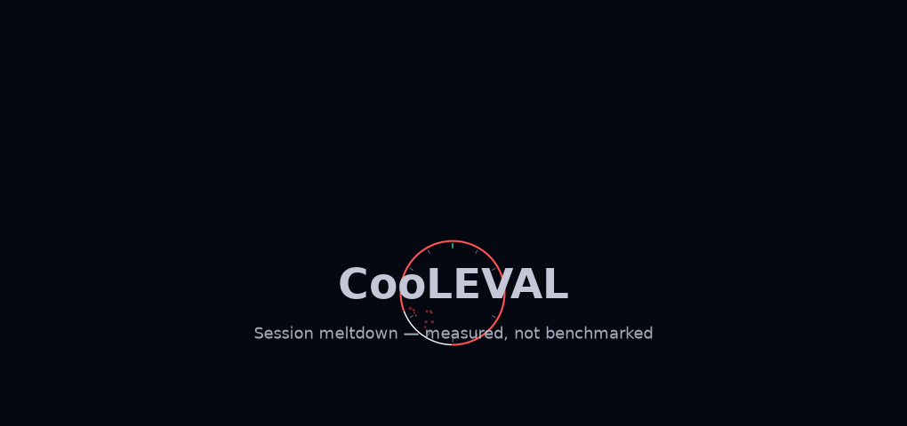
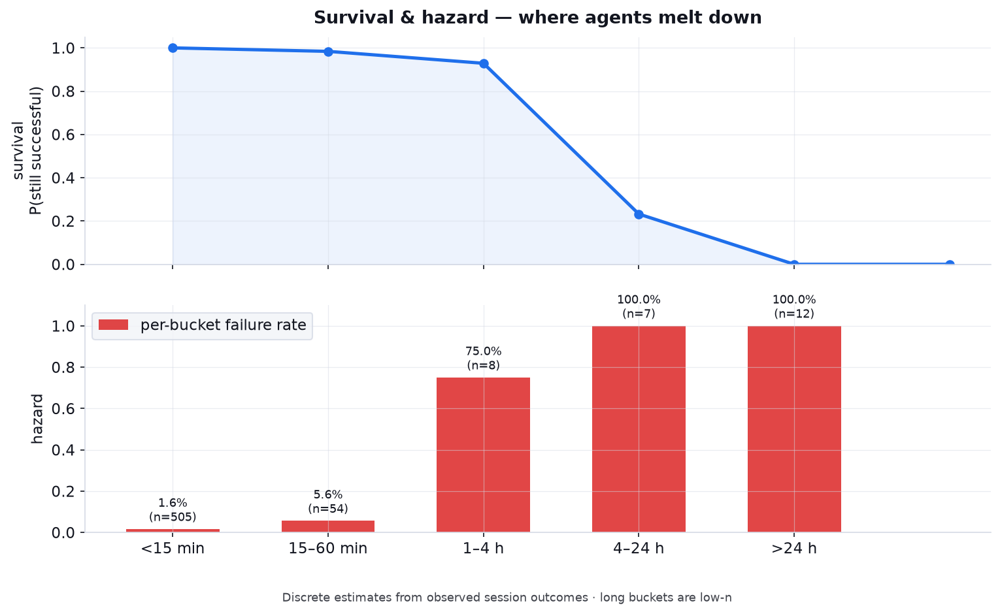
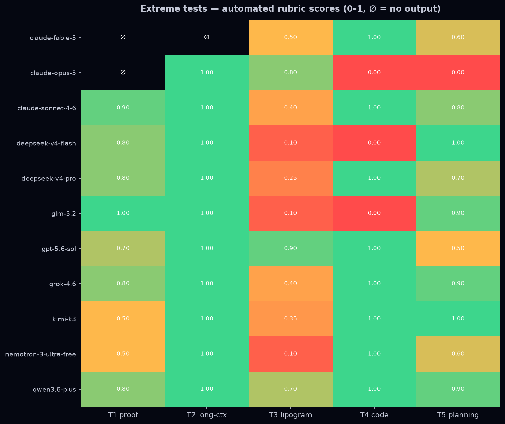
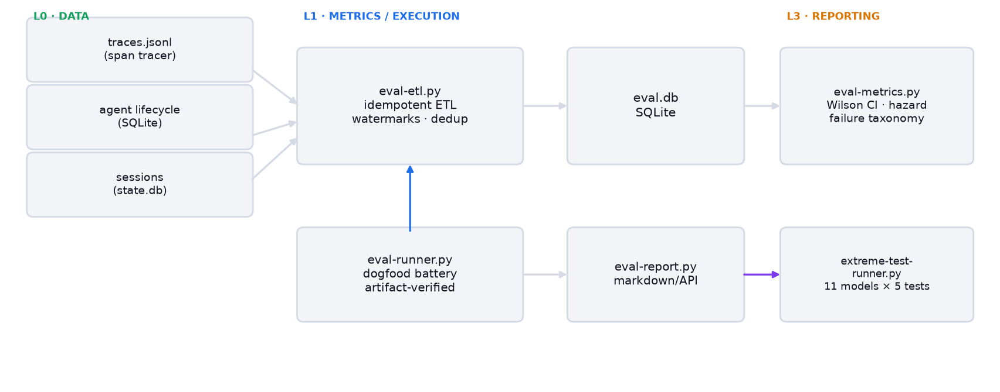

<p align="center">
  
</p>

<h1 align="center">CooLEVAL</h1>

<p align="center"><strong>Agent success collapses past the one-hour mark — measured on production traffic, not a benchmark.</strong></p>

<p align="center">
  <a href="docs/README-zh-TW.md"><strong>繁體中文導讀 →</strong></a>
</p>

<p align="center">
  <code>586 sessions</code> · <code>&lt;15min 98.4%</code> · <code>&ge;1h 7.4% (2/27)</code>
</p>

<p align="center">
  
  
  
</p>

<p align="center">
  <a href="#the-meltdown-curve">See the curve</a> · <a href="#quickstart">Quickstart</a> · <a href="#extreme-tests--where-the-ceiling-actually-shows">Extreme tests</a> · <a href="#memory-eval--the-layer-under-the-model">Memory-Eval</a> · <a href="#limitations">Limitations</a>
</p>

> Dogfood evaluation framework for production AI agents. Every number in this README
> comes from `eval-metrics.py` over real sessions, run 2026-08-16 — not a synthetic
> benchmark. One-liner with a risk ratio: **13.3× more likely to fail at ≥1 h than under 15 min.**

## The Meltdown Curve

Short sessions look great. Long sessions don't fail linearly — they collapse.
CooLEVAL instruments **your agent on your workload** and measures success by session
duration, with Wilson 95% CIs and artifact-verified outcomes (never self-report).



| Duration | n | Success | 95% CI (Wilson) |
|---|---:|---:|---:|
| < 15 min | 505 | 98.4% | [96.9–99.2%] |
| 15–60 min | 54 | 94.4% | [84.9–98.1%] |
| 1–4 h † | 8 | 25.0% | [7.1–59.1%] |
| 4–24 h † | 7 | 0.0% | [0.0–35.4%] |
| > 24 h † | 12 | 0.0% | [0.0–24.3%] |
| **≥ 1 h (pooled)** | **27** | **7.4%** | **[2.1–23.4%]** |

† n < 20 — exploratory per n-gate. The individual long buckets are low-n; the pooled
contrast is not: **497/505 vs 2/27, Fisher exact p = 9.2e-34**. If your agent runs for
more than an hour, it probably fails.

## Survival & Hazard Analysis

<picture>
  <source media="(prefers-color-scheme: dark)" srcset="assets/survival_hazard_dark.png">
  
</picture>

Survival (blue) tracks the probability a session is still successful as duration
grows; hazard (red) is the per-bucket failure rate. Guardrail metrics — tool
retries, loop events, context growth — are tracked as meltdown *precursors*, so you
can intervene before failure, not after.

## Quickstart

What you need: Python 3.10+, SQLite3, and agent telemetry in the expected schema
(JSONL spans + lifecycle events; see the header of `scripts/eval-etl.py`). Paths are
overridable via `EVAL_DB` / `EVAL_OUT` / `EVAL_ROOT` env vars.

```bash
git clone https://github.com/CooLCHI-gun/CooLEVAL.git && cd CooLEVAL
pip install pyyaml          # only dep outside stdlib

# 1. Ingest telemetry (idempotent — safe to rerun)
python3 scripts/eval-etl.py

# 2. Metrics: success rate, hazard curve, failure taxonomy (Wilson CIs, n-gate)
python3 scripts/eval-metrics.py

# 3. Dogfood battery: N runs of real tasks through your agent loop, artifacts verified
python3 scripts/eval-runner.py --task t1_file_summary --runs 10

# 4. Compare models on the same real tasks (any provider your agent supports)
python3 scripts/eval-runner.py --model claude-sonnet-4-6 --provider opencode-zen --runs 3

# 5. Extreme ceiling battery: frontier models × 5 hard tests via direct API
python3 scripts/extreme-test-runner.py --models claude-opus-5,deepseek-v4-pro

# 6. Report
python3 scripts/eval-report.py
```

Task specs are pre-registered with `spec_hash` and `difficulty` — reproducibility
without outcome-inferred labels.

### Use it as an MCP server (agents)

Query CooLEVAL's measured results from another agent via a read-only MCP server
(`scripts/cooleval_mcp.py`, wraps the eval SQLite DB — SELECT-only, no heavy deps):

```python
# register in an MCP client config:
{
  "mcpServers": {
    "cooleval": {
      "command": "python3",
      "args": ["/path/to/CooLEVAL/scripts/cooleval_mcp.py"]
    }
  }
}
```

Exposed tools: `cooleval_metrics` (success rate + Wilson CI + n-gate),
`cooleval_battery` (per-task/model battery, incl. usage), `cooleval_token_efficiency`
(cache-adjusted tokens-per-success), `cooleval_memory_benchmark` (latest backend
recall by class), `cooleval_etl_watermark`. All read-only; the server never writes.

## Extreme Tests — where the ceiling actually shows

11 models (closed frontier, open weights, baseline), 5 hard ceiling tests, rubric
scored — see [RESEARCH.md](RESEARCH.md) for methodology and the animated race.

**All 11 models produced responses on all 5 tests; binary pass/fail is saturated.**
The only binary signal: T4 code failed `py_compile` for claude-opus-5, glm-5.2, and
deepseek-v4-flash. The discriminating signal is the rubric score — automated,
reproducible (`scripts/score_tests.py`):

| Model | Family | T1 proof | T2 long-ctx | T3 lipogram | T4 code | T5 planning | Total |
|:--|:--|:--:|:--:|:--:|:--:|:--:|:--:|
| qwen3.6-plus | open | 0.80 | 1.00 | 0.70 | 1.00 | 0.90 | **0.88** |
| claude-sonnet-4-6 | closed | 0.90 | 1.00 | 0.40 | 1.00 | 0.80 | 0.82 |
| gpt-5.6-sol | closed | 0.70 | 1.00 | 0.90 | 1.00 | 0.50 | 0.82 |
| grok-4.6 | closed | 0.80 | 1.00 | 0.40 | 1.00 | 0.90 | 0.82 |
| claude-opus-5 | closed | 0.70 | 1.00 | 1.00 | 1.00 | 0.20 | 0.78 |
| kimi-k3 | open | 0.50 | 1.00 | 0.35 | 1.00 | 1.00 | 0.77 |
| claude-fable-5 | closed | 0.90 | ∅ | 0.85 | 1.00 | 1.00 | 0.75 |
| deepseek-v4-pro | open | 0.80 | 1.00 | 0.25 | 1.00 | 0.70 | 0.75 |
| nemotron-3-ultra-free | open | 0.50 | 1.00 | 0.10 | 1.00 | 0.60 | 0.64 |
| glm-5.2 | open | 1.00 | 1.00 | 0.10 | 0.00 | 0.90 | 0.60 |
| deepseek-v4-flash | baseline | 0.80 | 1.00 | 0.10 | 0.00 | 1.00 | 0.58 |

∅ = no output returned for that test despite retries. Scoring is automated
string/compile checks — see `scripts/score_tests.py` for exact rubrics.



What the real situation says:
- **The lipogram test (no letter *e*) is the hardest**: best score 0.90 (gpt-5.6-sol),
  most models 0.10–0.40 — consistent with the known transformer weakness at
  character-level constraints.
- **Long-context recall saturated** (1.00 everywhere): at ~30K tokens, every model
  found the embedded facts. Not a differentiator at this size.
- **Empty-output investigation (2026-08-16)**: claude-opus-5 and claude-fable-5
  initially returned ∅ on the proof test — bisection showed a proxy-side silent
  empty response (200 OK, 0 tokens) triggered by specific prompt phrasing
  (e.g. the phrase "harder telescoping identity"), NOT a capability failure.
  With rephrased prompts both models score competitively (opus 0.78, fable 0.75).
  claude-fable-5's remaining ∅ on long-context persisted across retries — recorded
  honestly as a reliability limitation of that model route.
- Latency varies 6.3× (37–231 s/test); qwen3.6-plus is slowest by far (19 min total).

Pre-flight findings (2026-08, `price-probe.py`): providers list models that aren't
callable — all Claude-family endpoints rejected the `temperature` parameter
(deprecated), GPT-family required the Responses API, and a Gemini endpoint was down
entirely. The probe catches this before you waste a battery.

## Memory-Eval — the layer under the model

Agent reliability is not only a model property. The memory backend — what gets
stored, retrieved, and injected into context — determines whether the model ever
sees the right facts. CooLEVAL scores memory backends as first-class subjects,
with the same n-gate and honesty discipline applied to model evals.

Backends are exercised head-to-head on a shared fact corpus across four retrieval
classes: **single** (one fact, direct recall), **multi** (fact composition),
**noisy** (relevant fact buried in distractors), and **under** (under-specified
query — no lexical match, requires inference). The **under** class **gates to an
LLM judge** (`--llm`); the default dry run keeps scoring deterministic and never
confounds a head-to-head with judge variance.

### Controlled 8-fact probe (saturated)

Both backends answer 8/8. This N is too small to rank — it exists only to confirm
neither backend is broken before running the discriminating suite.

| Backend      | Score | Latency (min–max) |
|--------------|-------|-------------------|
| UHMA         | 8/8   | 1.6–7.1 ms        |
| Holographic  | 8/8   | 2.4–5.3 ms        |

**No winner is claimed at N=8.** Result is saturated.

### Discriminating benchmark (N=180 per class)

60 synthetic facts × 3 sessions = 720 queries per backend, ~7 s wall-clock, zero
API calls, deterministic. Per retrieval class (N=180 each):

| Retrieval class | UHMA         | Holographic  |
|-----------------|--------------|--------------|
| single          | 180/180 (100%) | 162/180 (90%) |
| multi           | 180/180 (100%) | 144/180 (80%) |
| noisy           | 45/180 (25%)   | 162/180 (90%) |
| under (→ `--llm`) | 9/180 (5%)   | 0/180 (0%)   |

The classes separate the backends sharply and in *opposite directions*: UHMA wins
clean recall (single/multi) but collapses under distractor noise, where Holographic
holds 90%. Neither backend is a general winner — the failure modes are the finding.

### OpenViking — gated, not deployed

The OpenViking provider class ships in the tree but is **not deployed**: a 1.2 GB
install plus heavy dependencies is indefensible on the 4 GB reference box. It runs
gated and emits a server-down trace so evals fail loud rather than silently skip.

### Caveats

- Corpus is **synthetic/constructed**, not production telemetry.
- **Single run** — no cross-run variance reported.
- **Exploratory, not confirmatory.** These numbers motivate hypotheses; they do not
  certify a backend. Re-run with `--llm` and multiple seeds before citing.

## Cost & Efficiency

`eval-runner` captures token telemetry via `--usage-file`; `eval-tokeneff.py`
derives two per-model metrics:

- **cache-adjusted tokens-per-success** — total billable tokens (prompt cache hits
  discounted at the provider's cached rate, output tokens counted in full) divided
  by the number of *successful* tasks. Failed tasks still spend tokens, so this
  charges wasted spend against the successes it produced.
- **USD-per-success** — the same denominator against real billed dollars.

**These are cost metrics, not quality metrics.** A lower tokens-per-success means a
model reached correct answers more cheaply — it says nothing about answer quality,
reasoning depth, or robustness. Never rank models on efficiency alone; read it
beside the Wilson-CI success rate. A cheap model that fails the n-gate is not
efficient, it is just cheap.

## Architecture (L0–L3)

One script per layer, no framework.

<picture>
  <source media="(prefers-color-scheme: dark)" srcset="assets/architecture_dark.png">
  
</picture>

- **L0 · DATA** — `eval-etl.py`: idempotent ETL from JSONL traces + SQLite lifecycle + sessions → eval.db (watermarks, dedup, reconciliation)
- **L1 · METRICS** — `eval-metrics.py`: success rate (Wilson CI), hazard curve, failure taxonomy, tool-failure rates, loopiness guardrails
- **L2 · EXECUTION** — `eval-runner.py`: dogfood task battery (artifact-verified); `extreme-test-runner.py`: 5-test ceiling battery (direct API)
- **L3 · REPORT** — `eval-report.py`: markdown report; `eval-api.py`: read-only REST

## Design Principles

- **Canonical task spec** — `task_key` + `spec_hash` + pre-registered difficulty; no outcome-inferred labels.
- **Failure taxonomy** — completed / failed / partial / user_abort / infra_fail with failure class; execution ≠ prompt ≠ tooling failure.
- **Hazard/survival analysis** — P(success \| duration ≥ t), pre-registered buckets + CIs; no post-hoc cutoff cherry-picking.
- **Minimum n gate** — n < 20 flagged exploratory; Wilson 95% intervals everywhere.
- **Artifact-verified outcomes** — pass = artifact exists and non-empty, checked independently of the agent's self-report.
- **Idempotent, reconcilable ETL** — rerunnable, dedup-able, auditable; automation only after the pipeline is proven.

## Repository Layout

```
scripts/
  eval-etl.py              L0 ETL (idempotent, reconcilable)
  eval-metrics.py          L1 metrics (Wilson CI, hazard curve, n-gate)
  eval-runner.py           L2 dogfood battery (artifact-verified)
  eval-report.py           L3 report generation
  eval-api.py              read-only REST API over the eval DB
  price-probe.py           provider pre-flight: which listed models actually respond
  extreme-test-runner.py   5-test ceiling battery (direct API, multi-provider)
  score_tests.py           automated rubric scoring + heatmap
  summarize_extreme.py     battery results → summary table
  memory_provider.py       MemoryProvider ABC + UHMA (S1) / Holographic (S2) / OpenViking (S3)
  eval-memory.py           RAM-guarded memory-eval task runner (T1-T10, protocol JSONL)
  bench_s1s2.py            controlled same-corpus UHMA-vs-Holographic memory comparison
  memory_health_report.py  memory-recall health report (aggregate-only, Wilson CI, rolling windows)
  eval-tokeneff.py         token-efficiency metric (cache-adjusted tokens-per-success)
  eval-memory-full.py      discriminating memory benchmark (N>=150, query taxonomy + cross-session decay)
  cooleval_mcp.py          read-only MCP server over the eval DB (for other agents)
  make_assets.py           regenerate static visuals (dark + light themes)
  make_animate.py          regenerate animated GIFs + logo
assets/                    original visuals (static, animated, logo.svg)
reports/                   generated reports
CONTRIBUTING.md            contribution + stats-honesty contract
RESEARCH.md                probe findings, model batteries, methodology
docs/
  README-zh-TW.md          繁體中文導讀 (reading guide; English README is canonical)
  memory-eval-protocol.md  memory-backend comparison protocol (S1/S2/S3 design, metrics)
```

## Limitations

- Single-organization traffic: these numbers come from one deployment's workload, not a controlled benchmark.
- Task boundaries are self-reported by the session lifecycle; no covariate control for task difficulty vs duration.
- Long-duration buckets are small (n=8/7/12); the pooled ≥1h contrast is the defensible claim.
- Battery one-shot sessions are excluded from session-level analysis by a pre-registered rule.
- Memory-eval corpus is synthetic/constructed and a single run — exploratory, not confirmatory; the under-class is gated to an LLM judge.
- Rubric scores are automated string/compile checks — not human expert grading.

## Roadmap

- [x] ETL + metrics + dogfood battery (artifact-verified)
- [x] Extreme ceiling battery (5 tests, direct API, multi-provider)
- [x] Automated rubric scoring (0–1 per test, reproducible)
- [x] Memory-backend comparison battery (UHMA / Holographic / OpenViking, see docs/)
- [x] Semantic validation of artifacts (tiered deterministic content checks)
- [x] Token-efficiency metric (tokens-per-success, cache-adjusted)
- [x] Full memory benchmark (ambiguous/noisy queries, cross-session decay, N≥150)
- [x] Read-only MCP server over the eval DB (for other agents)
- [ ] Weekly scheduled reports

## License

MIT — see [LICENSE](LICENSE).
