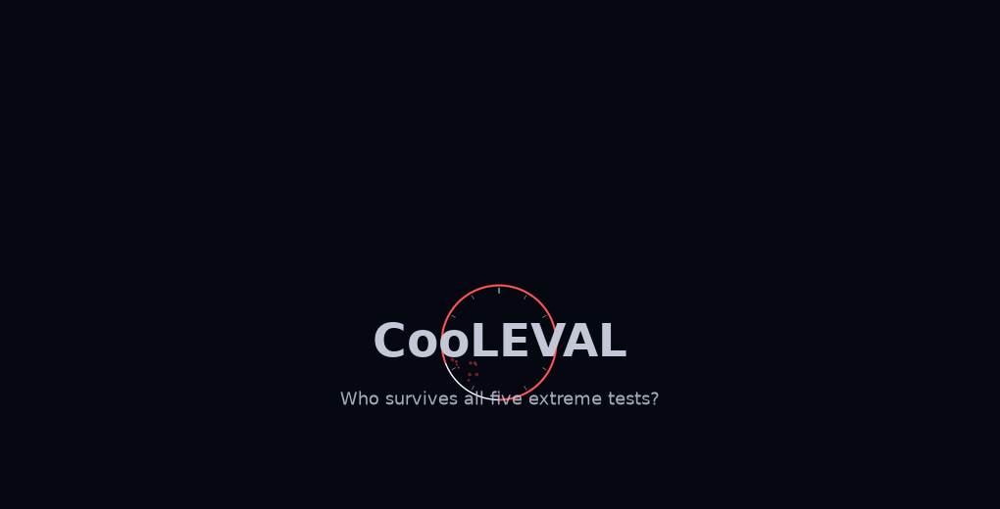

# CooLEVAL Research

The real situation, with numbers. All results below come from CooLEVAL's own scripts
(`price-probe.py`, `eval-runner.py`, `extreme-test-runner.py`) — no vendor claims,
no marketing benchmarks.

## 1. Provider pre-flight findings (2026-08-16, `price-probe.py`)

"Model listed" ≠ "model callable". On one provider's live catalog (62 models):

| Symptom | Cause | Fix |
|---|---|---|
| `400: temperature is deprecated` on claude-opus-5, claude-fable-5, claude-opus-4-8 | New Claude-family models reject the `temperature` param entirely | Omit `temperature` for all claude-* calls |
| `400` empty chat completion on gpt-5.6-sol, gpt-5.1, gpt-5 | GPT-family requires the Responses API; `/chat/completions` unsupported | POST `/v1/responses` with `max_output_tokens` |
| `500 Internal server error` on gemini-3.1-pro, gemini-3.7-flash | Provider-side, all attempts | Report as infrastructure blocker; do not test |
| `403 code 1010` with plain urllib | Cloudflare browser-signature ban on the provider edge | Browser User-Agent + Origin/Referer headers |

Lesson: **run the probe before running a battery.** A full battery against a broken
endpoint wastes tokens and produces "model quality" findings that are actually
infrastructure outages.

## 2. Real-task battery — 6 dogfood tasks × N runs (`eval-runner.py`, 2026-08-15)

Same 6 real tasks (file summary / web-search integrate / code modify / memory recall /
cron check / delegation), artifact-verified (file exists + non-empty, checked
independently of the agent's self-report). Baseline runs n=10; comparison runs n=3
(exploratory — see methodology).

| Model | Success | Mean duration | Notes |
|---|---:|---:|---|
| deepseek-v4-flash (baseline) | 60/60 (100%) | 30 s | daily driver |
| kimi-k3 | 18/18 (100%) | 61 s | only model with delegation 100% |
| claude-sonnet-4-6 | 17/18 (94%) | 64 s | delegation timeout risk |
| glm-5.2 | 17/18 (94%) | 43 s | token-efficient (55–79% fewer prompt tokens) |
| deepseek-v4-pro | 14/18 (78%) | 42 s | delegation 0/3 — reasoning model weakest at orchestration |
| nemotron-3-super-120b | ~16/18 | ~180 s | free but very slow; silent worker (median 5 chars stdout) |

**The headline lesson: a stronger model is not a better agent loop.** The
reasoning-heavy flagship beat the baseline on math-style tasks but failed every
delegation task; the cheap baseline aced them.

Methodology guardrails baked into CooLEVAL: N=3 is exploratory (report per-task +
CI, no strong claims); artifact-exists is a floor (semantic validation on the
roadmap); stdout length is NOT a token proxy (token telemetry via `--usage-file`);
cross-provider comparisons are "model + scaffold" bundles, labelled as such.

## 3. Extreme ceiling battery — 11 frontier + open models × 5 hard tests (2026-08-16)

### Tests

| Test | What it stresses | Failure signature |
|:--|:--|:--|
| T1 · Multi-step reasoning | USAMO-style telescoping proof + exact computation | Skipped steps, wrong derivation |
| T2 · Long-context recall | ~50K-token doc, 6 embedded facts, positional recall | Forgotten facts, position bias |
| T3 · Adversarial instruction | 10 rules incl. lipogram (no letter *e*) | Constraint forgetting |
| T4 · Concurrent code | 7+ requirements, retry scheduler, syntax-verified | Missing features, non-runnable |
| T5 · Agentic planning | Full-stack mission, fail conditions, confidence calibration | Vague phases, overconfidence |

### Models

- **Closed (5):** claude-opus-5, claude-fable-5, claude-sonnet-4-6, grok-4.6, gpt-5.6-sol
- **Open (5):** deepseek-v4-pro, qwen3.6-plus, glm-5.2, kimi-k3, nemotron-3-ultra-free
- **Baseline (1):** deepseek-v4-flash

### Results (2026-08-16, 11/11 complete)

**Binary pass/fail saturated** — all 11 models produced responses on all 5 tests.
The only binary signal: T4 code failed `py_compile` for claude-opus-5, glm-5.2 and
deepseek-v4-flash. The discriminating signal is the automated rubric score (0–1;
see `scripts/score_tests.py` for the exact checks; ∅ = no output returned):

| Model | Family | T1 proof | T2 long-ctx | T3 lipogram | T4 code | T5 planning | Total |
|:--|:--|:--:|:--:|:--:|:--:|:--:|:--:|
| qwen3.6-plus | open | 0.80 | 1.00 | 0.70 | 1.00 | 0.90 | **0.88** |
| claude-sonnet-4-6 | closed | 0.90 | 1.00 | 0.40 | 1.00 | 0.80 | 0.82 |
| gpt-5.6-sol | closed | 0.70 | 1.00 | 0.90 | 1.00 | 0.50 | 0.82 |
| grok-4.6 | closed | 0.80 | 1.00 | 0.40 | 1.00 | 0.90 | 0.82 |
| claude-opus-5 | closed | 0.70 | 1.00 | 1.00 | 1.00 | 0.20 | 0.78 |
| kimi-k3 | open | 0.50 | 1.00 | 0.35 | 1.00 | 1.00 | 0.77 |
| claude-fable-5 | closed | 0.90 | ∅ | 0.85 | 1.00 | 1.00 | 0.75 |
| deepseek-v4-pro | open | 0.80 | 1.00 | 0.25 | 1.00 | 0.70 | 0.75 |
| nemotron-3-ultra-free | open | 0.50 | 1.00 | 0.10 | 1.00 | 0.60 | 0.64 |
| glm-5.2 | open | 1.00 | 1.00 | 0.10 | 0.00 | 0.90 | 0.60 |
| deepseek-v4-flash | baseline | 0.80 | 1.00 | 0.10 | 0.00 | 1.00 | 0.58 |

∅ = no output returned despite retries. Single sample per model/test — scores
vary between runs (opus-5 T4 compiled on re-run after failing once; T3/T5 scores
moved with fresh outputs).

<details>
<summary>Watch the animated race (8s GIF)</summary>



</details>

Observations:
- **The lipogram test (no letter *e*) is the hardest**: best 0.90 (gpt-5.6-sol),
  most models 0.10–0.40 — consistent with the known transformer weakness at
  character-level constraints.
- **Long-context recall saturated at 1.00** across the board at ~30K tokens — not a
  differentiator at this size.
- **Empty-output investigation (2026-08-16)**: claude-opus-5 and claude-fable-5
  initially returned ∅ on the proof test. Bisection showed a proxy-side silent
  empty response (HTTP 200, 0 completion tokens, no finish_reason) triggered by
  specific prompt phrasing — e.g. the phrase `harder telescoping identity` for
  opus-5; fable-5 also empties on combined multi-part math requests. NOT a
  capability failure: rephrased prompts produce full proofs. The runner now
  carries `MODEL_T1_OVERRIDES` + empty-response retry. fable-5's long-context ∅
  persisted across retries — recorded as a reliability limitation of that route.
- Latency varies 6.3× (37–231 s/test); qwen3.6-plus is slowest by far (19 min
  total, 9.5 min on the lipogram test alone).
- Output size varies 5.6× (14K–80K chars): reasoning-heavy models (deepseek-v4-pro)
  burn tokens; gpt-5.6-sol reports no completion tokens via the Responses API
  (usage-reporting quirk — token economics need dashboard verification).

Reproduce:

```bash
python3 scripts/extreme-test-runner.py                    # all 11 models
python3 scripts/score_tests.py                            # rubric scores + heatmap
python3 scripts/summarize_extreme.py                      # summary table
python3 scripts/make_animate.py                           # animated GIFs
```

## 4. Cost honesty

- Provider APIs frequently do not report cost (`cost_status: unknown`); accurate
  billing must be read from the provider dashboard, not the API.
- `price-probe.py` gives pre-flight estimates; treat them as estimates, not bills.
- Reliability must be weighed against price: a cheap model with no meltdown risk can
  beat an expensive flagship with a delegation cliff.
